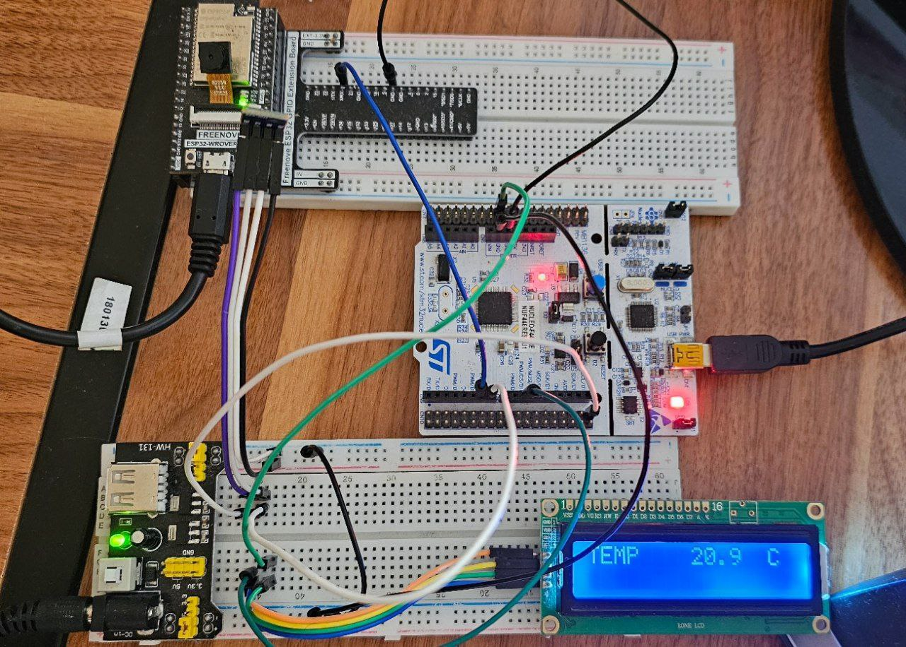

### General README for the Project

---

# **Smart Environmental Control System**

This project is a smart environmental control system that reads temperature data from a BMP180 sensor connected to an STM32 microcontroller, displays the data on an LCD (1602 I2C), and sends the data via UART to an ESP32. The ESP32 then transmits the data to a Flask server via Wi-Fi using HTTP requests. An Android application retrieves the data from the Flask server and displays the temperature on a mobile device.

## **Project Overview**

- **STM32**: Reads temperature from BMP180 sensor, displays it on an LCD, and sends data to ESP32 via UART.
- **ESP32**: Receives data from STM32, connects to Wi-Fi, and sends the data to a Flask server using HTTP.
- **Flask Server**: Receives and stores the latest temperature value and provides an API to retrieve it.
- **Android App**: Fetches the latest temperature from the Flask server and displays it on the mobile screen.

## **Hardware Used**
1. STM32F446RE
2. ESP32 WROVER
3. BMP180 Temperature Sensor
4. 1602 I2C Character LCD

## **Software Used**
1. STM32 HAL Library (CubeMX and Keil)
2. Platformio for ESP32 programming
3. Flask (Python-based web server)
4. Android Studio (for Android mobile application)
5. HTTP client for communication between ESP32 and Flask

---

This project includes multiple components that work together to collect environmental data using STM32, send it to ESP32, and display it in a mobile app.

## Project Structure

- **STM32 Project**: Collects sensor data (temperature) and sends it to ESP32.
- **ESP32 Project**: Receives data from STM32 and sends it to a web server.
- **Android App**: Displays the data from the server on a mobile interface.

## Subprojects

- [STM32 Code](./stm32/README.md): Code for the STM32 microcontroller to read sensors and send data via UART to the ESP32.
- [ESP32 Code](./esp32/README.md): Code for the ESP32 to receive data from STM32 and send it to the server using Wi-Fi.
- [Android App](./android/README.md): Code for the Android app to display the data retrieved from the web server.

## Setup Instructions

1. Follow the instructions in each subproject folder to set up the STM32, ESP32, and Android app.

---
## **Photo & gift**

